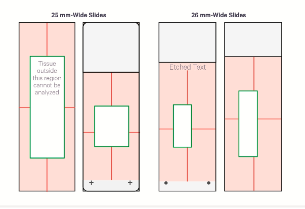
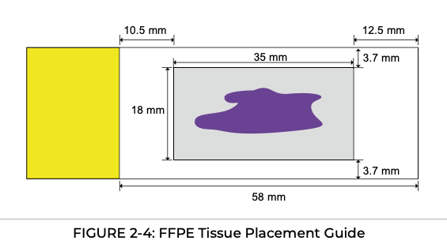

# FFPE Sectioning — Post-Processing and Storage Protocols

> Last updated: April 13, 2026
> Status: Visium HD | PhenoCycler | FISH

---

## 1. Visium HD (10x Genomics)

**Source:** Visium HD FFPE Tissue Preparation Handbook (CG000684); Visium CytAssist for Instrument Accessory Kit Instruction (CG000548)

### Pre-Experiment Notes

- Store FFPE tissue blocks at **4°C** and avoid exposure to direct light to preserve RNA integrity.
- Perform RNA quality assessment (DV200) prior to sectioning; 10x Genomics recommends DV200 > 30%.
- Recommended section thickness: **5 µm** (acceptable range: 3–10 µm; must not exceed 10 µm).

### Exposing the Tissue Block

| Step | Details |
|------|---------|
| a | Remove tissue block from storage |
| b | Set microtome to 15 µm |
| c | Place tissue block on the specimen clamp |
| d | Cut at 15 µm until all edges of the tissue are exposed or until the area of interest is exposed; the block should be at **room temperature** during cutting |

### RNA Quality Assessment

- Collect 10 µm sections for RNA extraction (~4 sections for tissue ≤6.5 mm; 1–2 sections for tissue >6.5 mm).
- Place sections in a pre-cooled, RNase-free microcentrifuge tube; sections may be stored at **-80°C** for long-term storage.
- Extract RNA using RNeasy FFPE Kit; quantify by Nanodrop/Qubit; measure DV200 using RNA 6000 Pico Kit or TapeStation High Sensitivity Kit.
- Purified RNA may be stored at **-80°C** for long-term use.

### Sectioning

| Step | Details |
|------|---------|
| a–b | Place tissue block in an **ice bath**, fully submerged; incubate for **10–30 min** depending on tissue type and extent of dehydration; monitor tissue surface every 5–10 min to avoid overhydration |
| c | Wipe excess oil from the 35X Ultra blade with a lint-free wipe and 100% ethanol; let ethanol evaporate; always use a new blade for each tissue type |
| d | Secure blade in disposable holder; set clearance angle to **10°C** |
| e | After hydration, place tissue block on specimen clamp and align with blade |
| f | Fill water bath with Milli-Q water; set temperature to **42°C** (recommended for most tissues; adjust ±1–2°C as needed); ensure surface is free of bubbles and particulates |
| g | Set microtome to **5 µm**; for previously exposed blocks, discard the first few sections before collecting |
| h–i | Lift section by lightly touching edge with paintbrush; immediately place section onto water bath surface |

> **Tips:** 42°C is the recommended water bath temperature for most tissues. If tissue expands too slowly → increase by 1–2°C. If tissue expands too quickly or dissociates → decrease by 1–2°C.

### 2.3 Section Placement and Drying

| Step | Details |
|------|---------|
| a | Trace the allowable area outline on the back of the blank slide with a laboratory marker before section placement (remove marker before CytAssist alignment) |
| b | Allow sections to float for the optimal time as previously determined |
| c | Hold blank slide vertically and insert into water bath, aligning the allowable area with the water surface |
| d | Use paintbrush or probe to maneuver section to the allowable area |
| e | Pull tissue slide up and out of the water, ensuring no air bubbles are trapped underneath; set aside in a standing rack |
| f | **Dry tissue sections upright at room temperature** until tissue is opaque and no water remains on top of or under the section; a fan may be used to assist; if no fan is used, allow up to **30 min at room temperature** — inspect visually, **DO NOT touch tissue** |
| g | Place tissue slides in a slide drying rack in a section dryer; incubate for **3 hours at 42°C** (alternatively, a thermal cycler set to 42°C may be used) |
| h | Place in a **desiccator** and keep overnight at **room temperature** to ensure proper drying |
| i | After overnight drying, proceed with optional morphology assessment or staining; **if not proceeding immediately, store tissue slides at room temperature or 4°C in a desiccator for up to 6 months** |

> **Slide selection note:** For tissues with large amounts of connective tissue (breast, skin, colon) or TMAs, 10x Genomics recommends Schott Nexterion Slide H – 3D Hydrogel Coated Slides (PN-1800434) to minimize tissue detachment. Store at -20°C; equilibrate at room temperature for 30 min before use.

  

Figure 1

### Storage Summary

| Condition | Maximum Duration |
|-----------|-----------------|
| Room temperature or **4°C** in a desiccator | Up to **6 months** |

---

## 2. PhenoCycler / CODEX (Akoya Biosciences / Quanterix)

**Source:** PhenoCycler-Fusion User Guide (PD-000011 REV K, 2023)

### Guidelines

- FFPE tissue sections mounted onto slides can be stored at **4°C for up to 6 months**.
- Section thickness must **not exceed 10 µm** (we use 5 µm).
- Tissue should be completely adhered to the slide with minimal tears or folds.
- Slides must be stored individually in a single slot — **do not stack slides on top of one another**.

### Required Materials

| Type | Item | Notes |
|------|------|-------|
| Consumables | 1" x 3" positively charged glass microscope slides | Recommended: Leica Apex Adhesive Slide (#3800080) or Fisherbrand Superfrost Plus (#12-550-15) |
| Consumables | Compressed/canned air duster | To remove dust from slides prior to use |
| Equipment | Microtome | — |
| Blade | Recommended: 63069-LP Low Profile Microtome Feather® Blade | — |
| Equipment | 40°C water bath | — |
| Optional | Angled slide holder | For laying and drying slides after section placement |
| Storage | Slide storage box | — |

### FFPE Tissues — Sectioning Procedure

| Step | Details |
|------|---------|
| 1 | Prepare a water bath at **40°C** and place it next to the microtome |
| 2 | Prepare a clean, dry surface for placing coated slides |
| 3 | Use compressed air to remove dust and lint from slides |
| 4 | Place slides next to the microtome |
| 5 | Insert a new blade for each new block, or as paraffin accumulates |
| 6 | Section tissue at **5–10 µm** (we do 5 µm)|
| 7 | Place sectioned tissue in water bath for a few seconds to allow it to flatten out |
| 8 | Once tissue is completely flat and free of folds/wrinkles, insert slide into water bath and maneuver tissue onto the slide; ensure tissue is centered; ensure tissue is placed on the positively charged side |
| 9 | Place slide on a clean surface (tissue facing up) or on angled slide holder; **dry overnight at room temperature** |
| 10 | Repeat steps 6–9 for each tissue section |
| 11 | When sections are dry, place each slide in a single slot of the storage box and cover with lid |

  

Figure 2

### Storage Summary

| Condition | Maximum Duration |
|-----------|-----------------|
| **4°C**, stored upright in slide storage box | Up to **6 months** |

> **Stopping Point (official quote):** *"If stored properly, samples can be stored at 4°C for up to six months. Store box in a secure location, kept upright as to minimize movement of slides."*

---

## 3. FISH (ecDNA detection, EGFR/CEP7 probes)

**Sources:** Personal communication — Empire Genomic & Pathologist (April 2026)

### Post-Sectioning Drying

Two options are acceptable for ensuring tissue adhesion to slide:

| Method | Details |
|--------|---------|
| **Option A — Room temperature overnight** | Dry slides flat or on angled holder at RT overnight (both recommended) |
| **Option B — Baking** | Bake at **56°C for ~1 hour** (Empire Genomics recommendation) |

> Either method should work for ensuring tissue adhesion. Choose based on available equipment and time constraints.

### Storage Recommendations

| Parameter | Empire Genomics | Pathologist |
|-----------|-------------------------------------|--------------------|
| **Short-term (≤2 weeks)** | RT, preferably with desiccant | RT is fine |
| **Long-term (>2 weeks)** | **−20°C** (freezing recommended) | Freezer extends shelf life; RT still acceptable for ~2 years |
| **Max duration at RT** | ~6 months best practice | ~**2 years** (reliability decreases after) |
| **Max duration frozen** | >6 months; >1 year possible (personal experience) | Longer than RT |

---

## Summary Comparison

| Platform | Post-Sectioning Drying | Storage Condition | Maximum Duration |
|----------|----------------------|-------------------|-----------------|
| **Visium HD** | RT ~30 min (air dry) → 42°C × 3h (oven) → desiccator overnight at RT | RT or 4°C + desiccator | 6 months |
| **PhenoCycler** | RT overnight (angled slide holder) | 4°C, upright in slide box | 6 months |
| **FISH** | RT overnight **or** 56°C × 1h (baking) | RT + desiccant (≤2 weeks) or −20°C (long-term) | >6 months |
